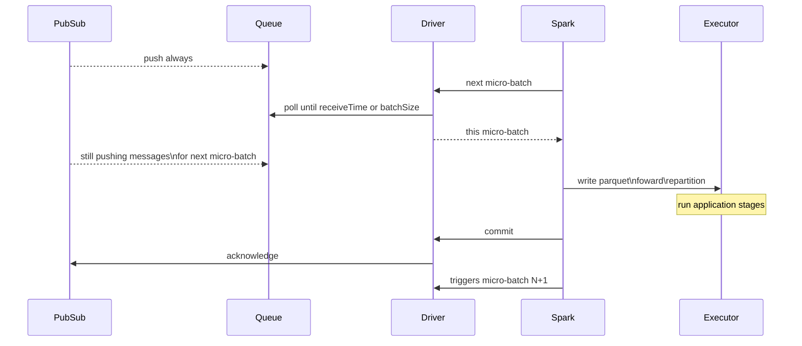
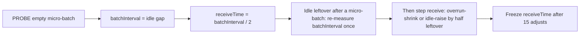

# spark-streaming-google-pubsub

Apache Spark connector for **Google Cloud Pub/Sub**.
Read a subscription into Structured Streaming with `.format("google-pubsub")`.


[](https://github.com/juarezr/spark-streaming-google-pubsub/actions/workflows/ci.yml)
[](https://github.com/juarezr/spark-streaming-google-pubsub/actions/workflows/release.yml)

## Why this connector

- Structured Streaming source (`google-pubsub`)
- At-least-once delivery by default (`ackMode=afterCommit`)
- No subscription rewind on restart unless you set `seek`
- Multi-pull gathering, retries, and ack-lease renewal for long-running jobs
- Spark **3.5** (Scala 2.12) and Spark **4.0–4.2** (Scala 2.13), including Dataproc **2.3** and **3.0**

Authentication uses **Application Default Credentials (ADC)** unless you set `credentialsFile`.

## Install

| Spark   | Scala | Artifact                                                     |
|---------|-------|--------------------------------------------------------------|
| 3.5.x   | 2.12  | `io.github.juarezr:spark-streaming-google-pubsub_2.12:0.9.0` |
| 4.0–4.2 | 2.13  | `io.github.juarezr:spark-streaming-google-pubsub_2.13:0.9.0` |

Prefer `--packages` or a Maven/Gradle dependency so Google client libraries come in as transitives.
Fat JARs (`*-all.jar`) are not on Maven Central; build with `mvn package` or download them from
[GitHub Releases](https://github.com/juarezr/spark-streaming-google-pubsub/releases).

## Quick start

### Java

```java
Dataset<Row> messages = spark.readStream()
    .format("google-pubsub")
    .option("projectId", "my-project")
    .option("subscription", "my-subscription")
    .option("ackMode", "afterCommit")
    .option("gatherMode", "batch")
    .option("schemaMode", "basic")
    .load();

messages
    .writeStream()
    .format("parquet")
    .trigger(Trigger.ProcessingTime("60 second"))
    .option("path", "gs://bucket/tables/event")
    .option("checkpointLocation", "gs://bucket/checkpoints/event")
    .start()
    .awaitTermination();
```

### Scala

See [`examples/scala/StructuredStreamingExample.scala`](examples/scala/StructuredStreamingExample.scala).

### PySpark

```python
messages = (
    spark.readStream.format("google-pubsub")
    .option("projectId", "my-project")
    .option("subscription", "my-subscription")
    .option("ackMode", "afterCommit")
    .option("gatherMode", "batch")
    .option("schemaMode", "mixed")
    .load()
)
```

Full script: [`examples/python/structured_streaming_example.py`](examples/python/structured_streaming_example.py).

## Options

| Option | Default | Description |
| :------- | :-------- | :------------ |
| `projectId` | required | GCP project id |
| `subscription` | required | Subscription id or full resource name |
| `credentialsFile` | ADC | Optional service-account JSON path |
| `seek` | `none` | `none`, `beginning`, `timestamp`, or `snapshot` |
| `seekTime` | | Seek instant when `seek=timestamp` |
| `seekSnapshot` | | Snapshot resource when `seek=snapshot` |
| `limitTime` | | Exclusive `publishTime` upper bound. Requires `Trigger.AvailableNow()`. With `seek=timestamp` the window is `[seekTime, limitTime)` |
| `maxRetryTime` | `min(90s, ackDeadline)` | Retry budget for ack and nack RPCs. Omit to clamp. |
| `ackMode` | `afterCommit` | `afterCommit` or `early` |
| `ackDeadline` | auto (`3 ×` batch interval, seed 180s) | Lease step; Subscriber renews until Spark commits. Omit to infer. |
| `gatherMode` | `batch` | `batch` collects until `receiveTime` / caps; `pull` returns a batch as soon as messages arrive |
| `receiveTime` | auto | How long this batch may take from the queue. Omit with `Trigger.ProcessingTime` |
| `batchSize` | `64m` | Max payload bytes per batch and Subscriber outstanding bytes. Capped by Spark `maxBytesPerTrigger` (Spark 4+) |
| `batchCount` | | Max messages per batch. Capped by Spark `maxRowsPerTrigger` |
| `numWriters` | `1` | Spark tasks per micro-batch; integer ≥1 or `auto` (driver CPU count) |
| `schemaMode` | `basic` | `raw`, `basic`, `slim`, `dynamic`, or `mixed` |
| `metadataMode` | `none` | `none`, `basic`, `slim`, or `full` |
| `topic` | | Topic id or full name (needed when schema is loaded from the topic) |
| `emulatorHost` | | Emulator address, for example `localhost:8085` |

Value formats:

- Time: `ms`, `s`, `m`. A bare number is seconds.
- Size: `k`, `m`, `g` (powers of 1024).
- Instants (`seekTime`, `limitTime`) are UTC. A local time needs an offset, for example `2024-08-07T12:00:29.028-03:00`.

## Schema

`schemaMode` is what `SELECT *` and `load()` return.

| `schemaMode` | Columns |
| :----------- | :------ |
| `raw` | `body` (binary) |
| `basic` | `body`, `messageid`, `publishtime` (default) |
| `slim` | `body`, `messageid`, `publishtime`, `orderingkey` |
| `dynamic` | fields from the topic Avro schema (JSON encoding) |
| `mixed` | topic Avro fields plus `messageid`, `publishtime` |

`metadataMode` adds extra columns you select by name. They are omitted from `SELECT *` when they
already exist on the table.

| `metadataMode` | Extra columns |
| :------------- | :------------ |
| `none` | none (default) |
| `basic` | `messageid`, `publishtime` |
| `slim` | `messageid`, `publishtime`, `orderingkey`, `ackid` |
| `full` | same as `slim` plus `attributes` (`map<string,string>`) |

Typical leftover metadata after name clashes:

| `schemaMode` | `metadataMode` | Extra columns you can still select |
| :----------- | :------------- | :--------------------------------- |
| `basic` | `basic` | none |
| `mixed` | `basic` | none |
| `slim` | `slim` | `ackid` |
| `dynamic` | `basic` | `messageid`, `publishtime` |

### Parsing

`dynamic` and `mixed` load the topic schema (JSON encoding, Avro type). Grant `pubsub.schemas.get`
and either `pubsub.topics.get` or `pubsub.subscriptions.get` if `topic` is omitted.

A user-supplied `readStream.schema(...)` becomes the table schema in every mode. Extra fields are
decoded from JSON in `body`.

### Watermarking

Watermark on `publishtime` with `schemaMode` `basic`, `slim`, or `mixed`:

```scala
.withWatermark("publishtime", "10 minutes")
```

For `raw` or `dynamic`, set `metadataMode=basic` (or higher) and select `publishtime`.

## How a query runs

The **driver** runs a warm Subscriber (StreamingPull) into a bounded queue. Each Spark
**micro-batch** polls that queue for up to `receiveTime` (or `batchSize`). Executors only write.
After the sink finishes, Spark commits and the driver acks (unless `ackMode=early`). The receiver
never acks.



An idle cycle does not start an empty micro-batch, so the sink does not write an empty file.

## Triggers and batching

| Spark trigger | What the connector does |
| :------------ | :---------------------- |
| `ProcessingTime` | Recommended for 24×7 jobs. Omit `receiveTime`; it is sized from the batch interval so write time still fits. |
| `AvailableNow` | Drain until idle or `limitTime`, then stop. Use for recovery, not a live feed that never goes quiet. |
| `Once` | Set `receiveTime` yourself. Without it the job can stop before the first receive. |
| `Continuous` | Not supported. |

| Connector gatherMode | What the connector does |
| :------------------- | :---------------------- |
| `gatherMode=batch` | Collects from the queue until `receiveTime`, `batchSize`, or `batchCount`. |
| `gatherMode=pull` | Returns a batch as soon as the queue has messages — lowest latency, more files. |

When to set `receiveTime` yourself:

- `Trigger.Once()`
- A short receive for low latency (more output files)
- A short receive and a longer batch interval, so the subscription buffers while Spark sleeps
- Do not set `receiveTime` equal to the batch interval: Spark still needs time to write.

Leave it unset for `Trigger.ProcessingTime` if you are unsure about the best value. The
connector will infer a sane value following this probe:



The leftover raise uses micro-batch start-to-start only when Spark slept (`gap > gather + write + 1s`).
A busy overrun (`cycle ≈ gap`) does not become the batch interval.
Receive keeps approximating for 15 cycles after that raise.

`ackDeadline` omitted is `3 ×` the inferred batch interval (180s at 60s). Subscriber keeps extending
until commit. `maxRetryTime` omitted is `min(90s, ackDeadline)`.

`Trigger.AvailableNow` keeps receiving until the batch caps or the queue looks idle (three empty
1s polls). Set `batchCount` or `batchSize` so a large backlog is split across batches.
`limitTime` is only valid with this trigger.

## Performance

| Goal | Settings |
| :--- | :------- |
| Low latency | `gatherMode=pull`, or a short `receiveTime` (more sink files) |
| Higher throughput | `gatherMode=batch`, omit `receiveTime` |
| Fewer files | omit `receiveTime`, keep `numWriters=1`, partition in the application |
| Recovery drain | `Trigger.AvailableNow`, `seek=snapshot` or `seek=timestamp`, optional `limitTime` |

`numWriters` only splits the already-received batch into Spark tasks. It does not start more
receive loops.

The driver holds payloads, ack ids, and attributes. Leave about 3–5× `batchSize` as heap headroom.

## Reliability

- **`ackMode=afterCommit` (default):** ack after Spark commits. A failure before commit redelivers
  (at-least-once). Leases are renewed until commit.
- **`ackMode=early`:** ack soon after receive. Faster release, higher loss risk on crash.
- An uncommitted batch that is replaced or stopped is nacked so Pub/Sub can redeliver quickly.
- Ack and nack RPCs retry for up to `maxRetryTime`.
- Checkpoints store progress, not payloads. After a driver crash, unacked messages redeliver from
  Pub/Sub.
- `seek=none` (default) never rewinds the subscription.

Watch `StreamingQueryProgress` in the Spark UI:

- `lastPullMessageCount`, `lastPullPayloadBytes`
- `lastPullMessageAgeMs` — age of the newest message in the last batch (`-` when empty)
- `outstandingPayloadBytes`
- `lastProducedBatchId`, `lastConsumedBatchId`
- `pubsubRetryAttempts`, `pubsubRetryAttemptsTotal`

These are connector metrics, not the Pub/Sub subscription backlog.

### Limitations

This is a **read-only micro-batch** source.

- No Spark Real-time Mode and no Continuous Processing.
- `Trigger.Once` needs an explicit `receiveTime`.
- `Trigger.AvailableNow` drains until idle (or `limitTime`). Pub/Sub is a queue, not a log with an
  end offset. Do not point it at a live 24×7 subscription that never goes idle.
- No streaming sink and no batch `spark.read`. Rewind with `seek` / snapshot options.
- A `WHERE publishtime >= …` does not seek a shared subscription. Filter attributes with a GCP
  subscription filter; rewind only with explicit `seek`.

## Recovery

Use a **dedicated recovery subscription** or a **snapshot**, not a live 24×7 feed.

1. Create a Pub/Sub snapshot of the subscription.
2. Start a one-shot job with `Trigger.AvailableNow`.
3. Set `seek=snapshot` (or `seek=timestamp` + `seekTime`) and optional `limitTime`.
4. The job writes until idle or until `publishTime` reaches `limitTime`, then exits.

Messages at or after `limitTime` stay on the subscription. Receive order is not a publish-time log,
so older stragglers after that last receive are not read.

```java
Dataset<Row> recovered = spark.readStream()
    .format("google-pubsub")
    .option("projectId", "my-project")
    .option("subscription", "my-subscription")
    .option("seek", "snapshot")
    .option("seekSnapshot", "projects/my-project/snapshots/recovery")
    .option("limitTime", "2026-09-18T12:34:45Z")
    .option("ackMode", "afterCommit")
    .option("gatherMode", "batch")
    .option("batchCount", "25000")
    .load();

recovered
    .writeStream()
    .format("parquet")
    .trigger(Trigger.AvailableNow())
    .option("path", "gs://bucket/tables/event-recovered")
    .option("checkpointLocation", "gs://bucket/checkpoints/event-recovered")
    .start()
    .awaitTermination();
```

## Platforms

### Dataproc

1. Prefer `--packages` so Google clients resolve from Maven Central. Or copy `*-all.jar` from a
   [GitHub Release](https://github.com/juarezr/spark-streaming-google-pubsub/releases) to GCS and
   pass `--jars`.
2. Use Dataproc 2.3 (Spark 3.5 / Scala 2.12) or 3.0 (Spark 4.1 / Scala 2.13). Spark 4.2 uses the
   same `_2.13` artifact on other platforms until Dataproc ships it.
3. Grant the cluster service account `roles/pubsub.subscriber` (and publisher if needed).
4. Use the metadata server for ADC — do not ship JSON keys.

```bash
gcloud dataproc jobs submit spark \
  --cluster=my-cluster \
  --region=us-east4 \
  --packages=io.github.juarezr:spark-streaming-google-pubsub_2.12:0.9.0 \
  --class=com.example.MyApp \
  -- gs://my-bucket/apps/my-app.jar
```

```bash
gcloud dataproc jobs submit spark \
  --cluster=my-cluster \
  --region=us-east4 \
  --jars=gs://my-bucket/jars/spark-streaming-google-pubsub_2.12-0.9.0-all.jar \
  --class=com.example.MyApp \
  -- gs://my-bucket/apps/my-app.jar
```

### Databricks

Add the Maven coordinate as a cluster library (`_2.12` or `_2.13` matching the runtime).
Configure a secret, instance profile, or GCP service account for ADC. Use the same
`.format("google-pubsub")` options and a durable `checkpointLocation` on cloud storage.

## Contributing

JDK 11+ (17 recommended), Maven 3.9+.

```bash
# Spark 3.5 / Scala 2.12 (default)
mvn -Pspark35 clean verify

# Spark 4.1 / Scala 2.13 (published _2.13 baseline)
mvn -Pspark41 clean verify

# Spark 4.0 / 4.2 (same artifactId; CI-only profiles)
mvn -Pspark40 clean verify
mvn -Pspark42 clean verify

mvn -Pspark35 spotless:check
mvn -Pspark35 spotless:apply
```

Unit tests: `mvn -Pspark35 test`.

Integration tests need a Pub/Sub emulator:

```bash
docker compose up --detach
export PUBSUB_EMULATOR_HOST=localhost:8085
mvn -Pspark35 verify
docker compose down --remove-orphans -v
```

Or run the emulator image directly:

```bash
docker run --rm -p 8085:8085 \
  gcr.io/google.com/cloudsdktool/google-cloud-cli:emulators \
  gcloud beta emulators pubsub start --host-port=0.0.0.0:8085
```

Against real GCP (ADC):

```bash
gcloud auth application-default login
# or: export GOOGLE_APPLICATION_CREDENTIALS=/path/to/sa.json

mvn -Pspark35 -DskipTests package

spark-submit \
  --class io.github.juarezr.spark.pubsub.examples.JavaStructuredStreamingExample \
  --jars target/spark-streaming-google-pubsub_2.12-0.9.0-all.jar \
  examples/java/JavaStructuredStreamingExample.java \
  YOUR_PROJECT YOUR_SUBSCRIPTION /tmp/pubsub-cp /tmp/pubsub-out
```

Publishing: [`docs/publishing-maven-central.md`](docs/publishing-maven-central.md).

## License

GPL-3.0 — see [`LICENSE`](LICENSE).
