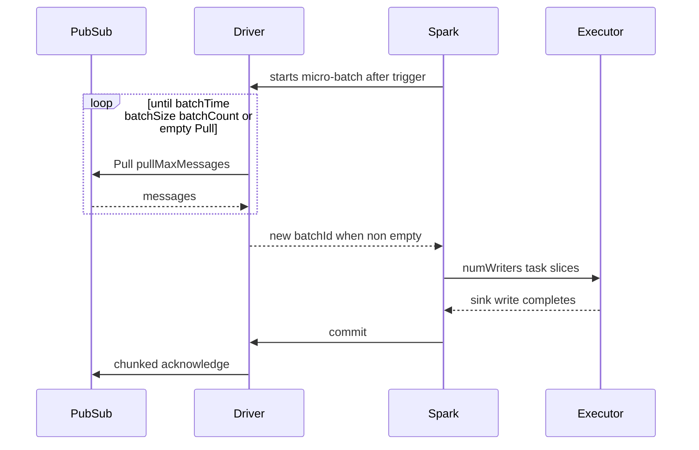

# spark-streaming-google-pubsub

Apache Spark connector for **Google Cloud Pub/Sub** (standard).
Read messages from a subscription into **Structured Streaming** via `.format("google-pubsub")`.


[](https://github.com/juarezr/spark-streaming-google-pubsub/actions/workflows/ci.yml)
[](https://github.com/juarezr/spark-streaming-google-pubsub/actions/workflows/release.yml)

## Why this connector

This project aims to deliver:

- Structured Streaming Data Source V2 (`MicroBatchStream`)
- Configurable ack semantics (`afterCommit` default, optional `early`)
- No subscription rewind on restart unless you set `seek`
- Multi-pull gathering, retries, and ack-lease renewal for 24×7 jobs
- Support for newer/modern Dataproc images

### Characteristics

This connector is designed for Spark **3.5** (Scala 2.12) and Spark **4.0–4.2** (Scala 2.13; built against 4.1), including GCP Dataproc **2.3** (Spark 3.5) and **3.0** (Spark 4.1).

The authentication defaults to **Application Default Credentials (ADC)**.

## Using this connector

### Coordinates

| Spark   | Scala | Artifact                                                     |
|---------|-------|--------------------------------------------------------------|
| 3.5.x   | 2.12  | `io.github.juarezr:spark-streaming-google-pubsub_2.12:0.6.3` |
| 4.0–4.2 | 2.13  | `io.github.juarezr:spark-streaming-google-pubsub_2.13:0.6.3` |

- Prefer `--packages` (or a Maven/Gradle dependency) so Google client libraries resolve as transitives.
- Fat JAR (`*-all.jar`, Google client deps bundled) are **not** published to Maven Central.
- You can build locally with `mvn package`, or find them attached to [GitHub Releases](https://github.com/juarezr/spark-streaming-google-pubsub/releases).

### Options

| Option | Default | Description |
| :------- | :-------- | :------------ |
| `projectId` | required | GCP project id |
| `subscription` | required | Subscription id or full resource name |
| `credentialsFile` | ADC | Optional service-account JSON path |
| `seek` | `none` | `none`, `beginning`, `timestamp`, or `snapshot` |
| `seekTime` | | Epoch milliseconds or RFC-3339 instant with `Z`/offset |
| `seekSnapshot` | | Snapshot resource for `seek=snapshot` |
| `pullMaxMessages` | `1000` | Messages requested by each Pull RPC (1–1000) |
| `maxRetryTime` | `90s` | Retry window for ack/nack/lease-extend. Pull retries stop at remaining gather |
| `pullDeadline` | `20s` | Deadline for one Pull long-poll. Idle gather returns after one empty Pull plus a 1s debounce |
| `ackMode` | `afterCommit` | `afterCommit` or `early` |
| `ackDeadline` | `60s` | Message lease, renewed about every third of this duration |
| `gatherMode` | `batch` | `batch` gathers Pulls; `pull` emits one Pull per micro-batch |
| `batchTime` | | Maximum gather time in `batch` mode. If omitted will be auto infered from `Trigger.ProcessingTime` |
| `batchSize` | `128m` | Maximum gathered payload bytes; blank/0 disables. Effective cap is the min of this and Spark `maxBytesPerTrigger` (Spark 4+) |
| `batchCount` | | Maximum gathered message count; blank/0 disables. Effective cap is the min of this and Spark `maxRowsPerTrigger` |
| `numWriters` | `1` | Spark task slices; integer ≥1 or `auto` for driver CPU count |
| `schemaMode` | `basic` | `raw`, `basic`, `slim`, `dynamic`, or `mixed` |
| `metadataMode` | `none` | `none`, `basic`, `slim`, or `full`. Metadata never repeats a table field |
| `topic` | | Topic id or full resource name (Optional) |
| `emulatorHost` | | Emulator address such as `localhost:8085` |

Used formats:

- The following suffixes can be used:
  - Time and deadline suffixes: `ms`, `s`, and `m`.
  - Size suffixes: `k`, `m`, and `g` use multiples of 1024.
- Bare time and deadline values are interpreted as seconds.
- Pub/Sub seek timestamps represent UTC instants.
  - A local wall-clock value must include its offset, for example `2024-08-07T12:00:29.028-03:00`.

### Schema (Structured Streaming)

The option `schemaMode` controls how each PubSub message is interpreted/transforme and which fields
are available in a `SELECT *` statement or in a Dataframe.

| `schemaMode` | Table columns |
| :----------- | :------------ |
| `raw` | `body` (binary) |
| `basic` | `body`, `messageid`, `publishtime` (default) |
| `slim` | `body`, `messageid`, `publishtime`, `orderingkey` |
| `dynamic` | fields from the topic Avro schema (JSON encoding only) |
| `mixed` | topic Avro fields plus `messageid`, `publishtime` |

The option `metadataMode` adds opt-in fields that are sent as metadata.

| `metadataMode` | Candidate columns (then minus table names) |
| :------------- | :------------------------------------------- |
| `none` | none (this is the default value) |
| `basic` | `messageid`, `publishtime` |
| `slim` | `messageid`, `publishtime`, `orderingkey`, `ackid` |
| `full` | same as `slim` plus `attributes` (`map<string,string>`) |

These metadata fields above are **not** available for a `SELECT *` statement over the dataframe columns. Users must retrieve them by name.

**Schema/metadata combinations**:

 A metadata field that already exists as field on the schema/dataframe is omitted to avlid generating duplicated columns.

When using some combinations of this options, the deduplication could leave no metadata columns; that is legal:

| `schemaMode` | `metadataMode` | Leftover metadata |
| :----------- | :------------- | :------------------ |
| `basic` | `basic` | (none) |
| `mixed` | `basic` | (none) |
| `slim` | `slim` | `ackid` |
| `dynamic` | `basic` | `messageid`, `publishtime` |

**Other Details**:

Spark projects unused columns away; the reader emits only what the query requests.

You  can use the column `publishtime` to do watermarking with `schemaMode=basic` (default), `slim`, or `mixed`:

```scala
.withWatermark("publishtime", "10 minutes")
```

For `raw` or `dynamic`, set `metadataMode=basic` (or higher) and select `publishtime` first.

When using the `schemaMode=dynamic` and `mixed` the connector will fetch the topic schema (JSON encoding + Avro type only).
Grant `pubsub.schemas.get` and either `pubsub.topics.get` or `pubsub.subscriptions.get` (if `topic` is
omitted).

A user-supplied `readStream.schema(...)` becomes the table schema in every mode; extra fields are JSON-decoded from `body`.

### How it works

Pub/Sub Pull RPCs run on the **Spark driver**. Executors only process in-memory slices of messages
that the driver already gathered. With `gatherMode=batch`, one Spark micro-batch can contain several
Pull responses.



An idle gather returns the previous offset, so Spark does not run an empty micro-batch or create an empty output file.

### Timing controls

The timing controls apply at different points for PubSub pulls and acks:

| Component | Control | What it bounds |
| :---------- | :-------- | :--------------- |
| Spark | `Trigger.ProcessingTime` | When Spark asks for the next offset after the previous micro-batch finishes |
| Spark | `ReadLimit` | `maxRowsPerTrigger` / `maxBytesPerTrigger` (Spark 4+) composed with `batchCount` / `batchSize` |
| Connector | `batchTime` | How long one batch gathers Pull responses. Omit to auto-infer from `Trigger.ProcessingTime` |
| Connector | `pullDeadline` | How long one healthy Pull RPC waits for messages. Idle gather returns after one empty Pull plus a 1s debounce |
| Connector | `ackDeadline` | How long Pub/Sub leases a delivered message; renewed every `ackDeadline/3` until Spark commits |
| Connector | `maxRetryTime` | Retry window for ack/nack/lease-extend. Pull retries stop at remaining gather (`min(pullDeadline, remaining batchTime)`) |

Spark trigger and `batchTime` are sequential waits: gather, then sink write, then optional sleep
until the trigger interval. Spark never aborts an in-flight micro-batch. Setting `batchTime`
equal to the trigger leaves no slack for write and trips Spark's falling-behind warning.

**Recommend omitting `batchTime`** when the query uses `Trigger.ProcessingTime`. The connector
returns once with no Pull (an empty-gap probe) to seed `batchTime` from the next gather gap, then
gathers `batchTime/2` on the first real batch and `batchTime - writeAvg - writeStdev - safety` after that. That
first gap is a seed: checkpoint recovery can be ~10–20s, not the trigger. Later **idle**
gather start-to-start gaps raise `batchTime` (never shrink it) so a watchdog restart does not stay
locked at the recovery gap. Write stats ignore empty batches. Idle gathers return after the first
empty Pull plus one 1s debounce Pull. A gather loop also stops when the thread is interrupted so a
graceful stop returns in about one `pullDeadline`.

If `batchTime` is unset and Spark's trigger looks like `ProcessingTime(0)` (three gather
gaps under 1s), the connector uses gather `min(pullDeadline, 5s)` and warns once. Set `batchTime`
explicitly to override. `gatherMode=pull` is the right choice for lowest latency.

Set an explicit `batchTime` when using:

- **`Trigger.Once()`** — the cannot infer it from the micro-batch; without `batchTime` the job can stop
  without Pulling.
- **Low latency** — `gatherMode=pull` or a short gather (more sink files).
- **Intentional pull duty cycle** — short `batchTime` and a longer trigger (messages wait on the
  subscription during Spark's sleep).
- **Short trigger, long gather** — grouping is only `batchTime` / `batchSize`; the falling-behind
  warning emitted from Spark on every batch is expected.

The Spark triggers `Trigger.AvailableNow` and `Trigger.Continuous` are not supported.

In batch gathering, every Pull uses the smaller of `pullDeadline` and the remaining `batchTime`.
A client `DEADLINE_EXCEEDED` on Pull is an empty long-poll, not a retried failure. Transient Pull
errors such as `UNAVAILABLE` retry only until that same remaining gather slice elapses. Ack, nack,
and lease-extend still use `maxRetryTime` so commit can ack after a slow write.

The options `pullDeadline`, `ackDeadline`, and `maxRetryTime` do **not** auto-follow `batchTime`
or Spark's ProcessingTime trigger time. Each Pull is already `min(pullDeadline, remaining gather)`;
The option `ackDeadline` is a lease quantum renewed internally in the connector;
Pull retries cannot outlive the current gather slice. Those options defaults therefore work for a 1s trigger
and for a 10-minute trigger. Do not set `pullDeadline` equal to `batchTime` (idle would wait a full
trigger) or `ackDeadline` equal to `batchTime/2` (lease shorter than write).

The option `pullDeadline` bounds waiting **for** messages. `ackDeadline` bounds holding messages already
delivered. The ack watchdog starts with the first non-empty Pull and renews leases during both
gathering and sink processing.

### Operational tuning

- **Low latency:** use `gatherMode=pull` or a short explicit `batchTime`. This creates more sink files.
- **Higher throughput:** use `gatherMode=batch` and omit `batchTime` so gather fills the ProcessingTime
  trigger (minus write). Several Pulls can run in each Spark micro-batch.
- **Fewer parquet files:** omit `batchTime` (or set it slightly under the trigger), keep `numWriters=1`,
  and partition in the application. `numWriters=2` means two Spark tasks for one gathered batch, not
  two Pull loops.
- **`Trigger.Once()`:** set `batchTime` explicitly. AvailableNow is not supported.

The driver holds message byte arrays, ack ids, attributes, and serialization copies.
Reserve roughly 3–5 times the configured payload batch size as temporary driver-heap memory headroom.
The option `batchSize` limits gathered payload bytes; when it is reached, then the connector will finish the batch.

## Examples

### Structured Streaming (Java)

```java
Dataset<Row> messages = spark.readStream()
    .format("google-pubsub")
    .option("projectId", "my-project")
    .option("subscription", "my-subscription")
    .option("ackMode", "afterCommit")
    .option("gatherMode", "batch")
    .option("schemaMode", "basic")
    .load();

messages
    .writeStream()
    .format("parquet")
    .trigger(Trigger.ProcessingTime("60 second"))
    .option("path", "gs://bucket/tables/event")
    .option("checkpointLocation", "gs://bucket/checkpoints/event")
    .start()
    .awaitTermination();
```

### Structured Streaming (Scala)

See [`examples/scala/StructuredStreamingExample.scala`](examples/scala/StructuredStreamingExample.scala).

### Structured Streaming (PySpark)

```python
messages = (
    spark.readStream.format("google-pubsub")
    .option("projectId", "my-project")
    .option("subscription", "my-subscription")
    .option("ackMode", "afterCommit")
    .option("gatherMode", "batch")
    .option("schemaMode", "mixed")
    .load()
)
```

Full script: [`examples/python/structured_streaming_example.py`](examples/python/structured_streaming_example.py).

## Platform Usage

### Google Dataproc

1. Prefer `--packages` with the Maven coordinate so Google client dependencies resolve from Central.
   Alternatively, copy `*-all.jar` from a [GitHub Release](https://github.com/juarezr/spark-streaming-google-pubsub/releases) (or `mvn package`) to GCS and pass `--jars`.
2. Submit with Dataproc 2.3 (Spark 3.5 / Scala 2.12) or 3.0 (Spark 4.1 / Scala 2.13). Spark 4.2 is supported via the same `_2.13` coordinate on Apache Spark / other platforms until Dataproc ships it.
3. Grant the cluster service account `roles/pubsub.subscriber` (and publisher if needed).
4. Rely on the metadata server for ADC — do not ship JSON keys.

```bash
# Preferred: resolve the thin JAR and its Google client transitives
gcloud dataproc jobs submit spark \
  --cluster=my-cluster \
  --region=us-east4 \
  --packages=io.github.juarezr:spark-streaming-google-pubsub_2.12:0.6.3 \
  --class=com.example.MyApp \
  -- gs://my-bucket/apps/my-app.jar

# Alternative: single shaded JAR from GitHub Releases (or a local `mvn package`)
gcloud dataproc jobs submit spark \
  --cluster=my-cluster \
  --region=us-east4 \
  --jars=gs://my-bucket/jars/spark-streaming-google-pubsub_2.12-0.6.3-all.jar \
  --class=com.example.MyApp \
  -- gs://my-bucket/apps/my-app.jar
```

### Databricks

Add the Maven coordinate as a library on the cluster (`_2.12` or `_2.13` matching the runtime).
Configure a Databricks secret or instance profile / GCP service account so ADC works, then use the
same `.format("google-pubsub")` options as above. Use a durable `checkpointLocation` on cloud storage.

## Reliability

- With the option **`ackMode=afterCommit` (default):** messages are acknowledged after Spark commits the micro-batch.
  Failures before commit lead to redelivery (at-least-once).
- With the option **`ackMode=early`:** ack soon after pull. Faster ack release, higher loss risk on crash.
- With `ackMode=afterCommit`, deadlines are extended periodically on the driver (about every
  `ackDeadline / 3`) from the first Pull until commit.
- A replaced or stopped uncommitted batch is nacked so it can redeliver promptly.
- Acknowledgement, nack, and lease-extension requests are chunked.
- Transient **Pull** failures retry only until remaining gather elapses. They cannot outlive
  the current gather slice. Ack, nack, and lease-extend use exponential backoff for at most
  `maxRetryTime`. Retry warnings are rate-limited (at most every 15s) while counters continue
  to increase.
- Checkpoint offsets contain only a synthetic batch id. Payloads and ack ids stay in driver memory.
  After driver failure, unacknowledged messages redeliver from Pub/Sub (at-least-once).
- With `seek=none` (default), restart never rewinds the subscription.

### Recommendations

- Monitor custom metrics on `StreamingQueryProgress` (Spark UI)
- Look for: last-pull count/payload bytes, `lastPullMessageAgeMs` (age of the newest publish time in the last gather; `-` when empty),
  outstanding payload bytes, batch ids, `pubsubRetryAttempts`, and `pubsubRetryAttemptsTotal`.
- These are **not** the Pub/Sub subscription backlog.

### Limitations

This connector is a **read-only Structured Streaming (micro-batch)** source. The following Spark features are not implemented:

- **Spark 4.1 Real-time Mode** — does not fit this source's driver-side Pull and lease/ack model.
- **Trigger.Once** — works only with an explicit `batchTime`. If `batchTime` is unset, the empty-gap
  probe is the only micro-batch and the query can stop without Pulling.
- **Trigger.AvailableNow** (“drain then stop”) — a subscription has no durable log-end offset.
  Rate limits via `SupportsAdmissionControl` (`maxRowsPerTrigger`, `maxBytesPerTrigger` on Spark 4+)
  are implemented; AvailableNow still is not.
- **Continuous Processing** — experimental; Spark recommends Real-time Mode instead. Same lease-model mismatch.
- **Streaming sink and batch `spark.read`** — a subscription is a queue, not a table. Rewind/replay uses explicit `seek` / snapshot **options**, not a batch scan.
- **SQL filter pushdown that seeks** — a `WHERE publishtime >= …` must not rewind a **shared** subscription. Filter on attributes with a GCP subscription filter; rewind with explicit `seek`.

## Build and test locally

Requirements: JDK 11+ (17 recommended), Maven 3.9+.

```bash
# Spark 3.5 / Scala 2.12 (default)
mvn -Pspark35 clean verify

# Spark 4.1 / Scala 2.13 (published _2.13 baseline)
mvn -Pspark41 clean verify

# Spark 4.0 / 4.2 (same artifactId; CI-only profiles)
mvn -Pspark40 clean verify
mvn -Pspark42 clean verify

# Format check
mvn -Pspark35 spotless:check

# Apply formatting
mvn -Pspark35 spotless:apply
```

### Unit tests

```bash
mvn -Pspark35 test
```

### Integration tests (Pub/Sub emulator)

```bash
docker run --rm -p 8085:8085 \
  gcr.io/google.com/cloudsdktool/google-cloud-cli:emulators \
  gcloud beta emulators pubsub start --host-port=0.0.0.0:8085

export PUBSUB_EMULATOR_HOST=localhost:8085
mvn -Pspark35 verify
```

### Manual test against real GCP (ADC)

```bash
gcloud auth application-default login
# or: export GOOGLE_APPLICATION_CREDENTIALS=/path/to/sa.json

mvn -Pspark35 -DskipTests package

spark-submit \
  --class io.github.juarezr.spark.pubsub.examples.JavaStructuredStreamingExample \
  --jars target/spark-streaming-google-pubsub_2.12-0.6.3-SNAPSHOT-all.jar \
  examples/java/JavaStructuredStreamingExample.java \
  YOUR_PROJECT YOUR_SUBSCRIPTION /tmp/pubsub-cp /tmp/pubsub-out
```

(Use a compiled example JAR or paste the example into your application module.)

## Publishing

See [`docs/publishing-maven-central.md`](docs/publishing-maven-central.md).

### License

GPL-3.0 — see [`LICENSE`](LICENSE).
