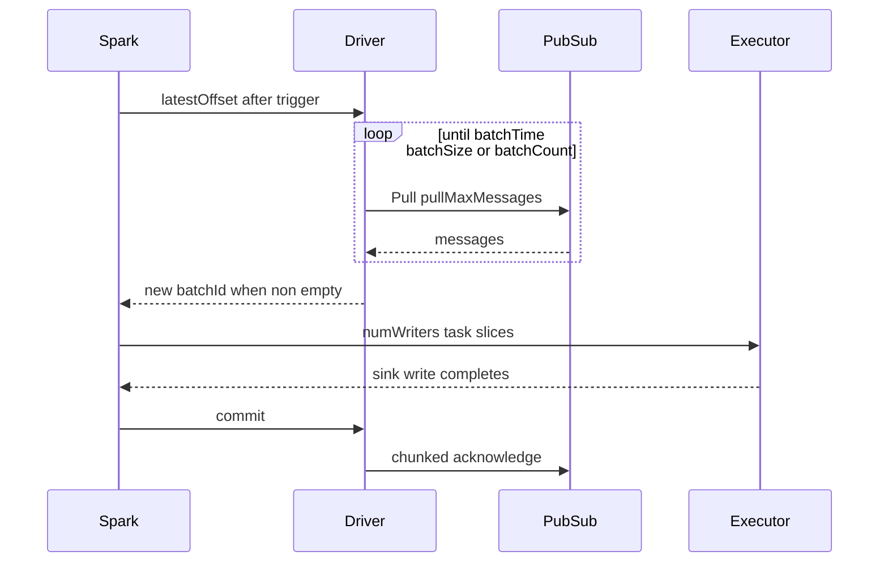

# spark-streaming-google-pubsub

Apache Spark connector for **Google Cloud Pub/Sub** (standard). Read messages from a subscription into **Structured Streaming** via `.format("google-pubsub")`.

Designed for Spark **3.5** (Scala 2.12) and Spark **4.0–4.2** (Scala 2.13; built against 4.1), including GCP Dataproc **2.3** (Spark 3.5) and **3.0** (Spark 4.1).
Authentication defaults to **Application Default Credentials (ADC)**.

## Why this connector

This project aims to deliver:

- Structured Streaming Data Source V2 (`MicroBatchStream`)
- Configurable ack semantics (`afterCommit` default, optional `early`)
- No subscription rewind on restart unless you set `seek`
- Multi-pull gathering, retries, and ack-lease renewal for 24×7 jobs
- Support for newer/modern Dataproc images

## Using this connector

### Coordinates

| Spark   | Scala | Artifact                                                     |
|---------|-------|--------------------------------------------------------------|
| 3.5.x   | 2.12  | `io.github.juarezr:spark-streaming-google-pubsub_2.12:0.4.1` |
| 4.0–4.2 | 2.13  | `io.github.juarezr:spark-streaming-google-pubsub_2.13:0.4.1` |

Prefer `--packages` (or a Maven/Gradle dependency) so Google client libraries resolve as transitives.

Fat JAR (`*-all.jar`, Google client deps bundled): built locally with `mvn package`, and attached to [GitHub Releases](https://github.com/juarezr/spark-streaming-google-pubsub/releases) — **not** published to Maven Central.

### Schema (Structured Streaming)

| Column        | Type                 | Description                                 |
|---------------|:---------------------|:--------------------------------------------|
| `messageId`   | string               | Pub/Sub message id                          |
| `data`        | binary               | Payload bytes                               |
| `attributes`  | `map<string,string>` | Attributes                                  |
| `publishTime` | timestamp            | Publish time                                |
| `orderingKey` | string               | Ordering key (may be empty)                 |
| `ackId`       | string               | Delivery token; normally drop before writing |

### How it works

Pub/Sub Pull RPCs run on the **Spark driver**. Executors only process in-memory slices of messages
that the driver already gathered. With `gatherMode=batch`, one Spark micro-batch can contain several
Pull responses. An idle gather returns the previous offset, so Spark does not run an empty
micro-batch or create an empty output file.



The timing controls apply at different points:

| Control | What it bounds |
|:--------|:---------------|
| Spark trigger | When Spark asks for the next offset after the previous micro-batch finishes |
| `batchTime` | How long one `latestOffset` gathers Pull responses |
| `pullDeadline` | How long one healthy Pull RPC waits for messages |
| `ackDeadline` | How long Pub/Sub leases a delivered message; renewed until Spark commits |
| `maxRetryTime` | How long failed Pub/Sub RPCs are retried |

Spark trigger and `batchTime` are sequential waits. For example, a 10-second trigger plus a
10-second gather can approach 20 seconds between batches. Prefer a short trigger and use
`batchTime` to control grouping. In batch gathering, the effective Pull deadline is the smaller of
`pullDeadline` and the remaining `batchTime`. `maxRetryTime` does not replace `pullDeadline`:
an empty long-poll is normal, while retries only follow an RPC failure.

`pullDeadline` bounds waiting **for** messages. `ackDeadline` bounds holding messages already
delivered. The ack watchdog starts with the first non-empty Pull and renews leases during both
gathering and sink processing.

### Options

Bare duration values are seconds. Duration suffixes are `ms`, `s`, and `m`. Size suffixes `k`, `m`,
and `g` use multiples of 1024.

| Option | Default | Description |
|:-------|:--------|:------------|
| `projectId` | required | GCP project id |
| `subscription` | required | Subscription id or full resource name |
| `credentialsFile` | ADC | Optional service-account JSON path |
| `seek` | `none` | `none`, `beginning`, `timestamp`, or `snapshot` |
| `seekTime` | | Epoch milliseconds or RFC-3339 instant with `Z`/offset |
| `seekSnapshot` | | Snapshot resource for `seek=snapshot` |
| `pullMaxMessages` | `1000` | Messages requested by each Pull RPC (1–1000) |
| `maxRetryTime` | `90s` | Retry window for transient RPC failures |
| `pullDeadline` | `20s` | Deadline for one Pull long-poll |
| `ackMode` | `afterCommit` | `afterCommit` or `early` |
| `ackDeadline` | `60s` | Message lease, renewed about every third of this duration |
| `gatherMode` | `batch` | `batch` gathers Pulls; `pull` emits one Pull per micro-batch |
| `batchTime` | `10s` | Maximum gather time in `batch` mode |
| `batchSize` | `128m` | Maximum gathered payload bytes; blank/0 disables |
| `batchCount` | | Maximum gathered message count; blank/0 disables |
| `numWriters` | `1` | Spark task slices; integer ≥1 or `auto` for driver CPU count |
| `emulatorHost` | | Emulator address such as `localhost:8085` |

Pub/Sub seek timestamps represent UTC instants. A local wall-clock value must include its offset,
for example `2024-08-07T12:00:29.028-03:00`; naive datetimes are rejected.

### Operational tuning

- **Low latency:** use `gatherMode=pull` or a short `batchTime`. This creates more sink files.
- **Higher throughput:** use `gatherMode=batch`, allowing several Pulls in each Spark micro-batch.
- **Fewer parquet files:** increase `batchTime`, keep `numWriters=1`, use a short Spark trigger, and
  partition in the application. `numWriters=2` means two Spark tasks for one gathered batch, not two
  Pull loops.

The driver holds message byte arrays, ack ids, attributes, and serialization copies. Allow roughly
3–5 times the configured payload batch size as temporary driver-heap headroom. `batchSize` limits
gathered payload bytes; it is not a Spark heap setting.

## Examples

### Structured Streaming (Java)

```java
Dataset<Row> messages = spark.readStream()
    .format("google-pubsub")
    .option("projectId", "my-project")
    .option("subscription", "my-subscription")
    .option("ackMode", "afterCommit")
    .option("gatherMode", "batch")
    .load();

messages
    .drop("ackId")
    .writeStream()
    .format("parquet")
    .trigger(Trigger.ProcessingTime("1 second"))
    .option("path", "gs://bucket/tables/event")
    .option("checkpointLocation", "gs://bucket/checkpoints/event")
    .start()
    .awaitTermination();
```

### Structured Streaming (Scala)

See [`examples/scala/StructuredStreamingExample.scala`](examples/scala/StructuredStreamingExample.scala).

### Structured Streaming (PySpark)

```python
messages = (
    spark.readStream.format("google-pubsub")
    .option("projectId", "my-project")
    .option("subscription", "my-subscription")
    .option("ackMode", "afterCommit")
    .option("gatherMode", "batch")
    .load()
    .drop("ackId")
)
```

Full script: [`examples/python/structured_streaming_example.py`](examples/python/structured_streaming_example.py).

## Platform Usage

### Google Dataproc

1. Prefer `--packages` with the Maven coordinate so Google client dependencies resolve from Central.
   Alternatively, copy `*-all.jar` from a [GitHub Release](https://github.com/juarezr/spark-streaming-google-pubsub/releases) (or `mvn package`) to GCS and pass `--jars`.
2. Submit with Dataproc 2.3 (Spark 3.5 / Scala 2.12) or 3.0 (Spark 4.1 / Scala 2.13). Spark 4.2 is supported via the same `_2.13` coordinate on Apache Spark / other platforms until Dataproc ships it.
3. Grant the cluster service account `roles/pubsub.subscriber` (and publisher if needed).
4. Rely on the metadata server for ADC — do not ship JSON keys.

```bash
# Preferred: resolve the thin JAR and its Google client transitives
gcloud dataproc jobs submit spark \
  --cluster=my-cluster \
  --region=us-east4 \
  --packages=io.github.juarezr:spark-streaming-google-pubsub_2.12:0.4.1 \
  --class=com.example.MyApp \
  -- gs://my-bucket/apps/my-app.jar

# Alternative: single shaded JAR from GitHub Releases (or a local `mvn package`)
gcloud dataproc jobs submit spark \
  --cluster=my-cluster \
  --region=us-east4 \
  --jars=gs://my-bucket/jars/spark-streaming-google-pubsub_2.12-0.4.1-all.jar \
  --class=com.example.MyApp \
  -- gs://my-bucket/apps/my-app.jar
```

### Databricks

Add the Maven coordinate as a library on the cluster (`_2.12` or `_2.13` matching the runtime).
Configure a Databricks secret or instance profile / GCP service account so ADC works, then use the
same `.format("google-pubsub")` options as above. Use a durable `checkpointLocation` on cloud storage.

## Reliability

- **`ackMode=afterCommit` (default):** messages are acknowledged after Spark commits the micro-batch.
  Failures before commit lead to redelivery (at-least-once).
- **`ackMode=early`:** ack soon after pull. Faster ack release, higher loss risk on crash.
- With `ackMode=afterCommit`, deadlines are extended periodically on the driver (about every
  `ackDeadline / 3`) from the first Pull until commit.
- A replaced or stopped uncommitted batch is nacked so it can redeliver promptly.
- Acknowledgement, nack, and lease-extension requests are chunked.
- Transient failures use exponential backoff for at most `maxRetryTime`. Retry warnings are
  rate-limited while counters continue to increase.
- Checkpoint offsets contain only a synthetic batch id. Payloads and ack ids stay in driver memory.
  After driver failure, unacknowledged messages redeliver from Pub/Sub (at-least-once).
- With `seek=none` (default), restart never rewinds the subscription.

Monitor custom metrics on `StreamingQueryProgress` (Spark UI): last-pull count/payload bytes,
outstanding payload bytes, batch ids, `pubsubRetryAttempts`, and
`pubsubRetryAttemptsTotal`. These are **not** the Pub/Sub subscription backlog.

### Limitations

This connector is a **read-only Structured Streaming (micro-batch)** source. The following Spark features are not implemented:

- **Spark 4.1 Real-time Mode** — does not fit this source's driver-side Pull and lease/ack model.
- **Trigger.AvailableNow** (“drain then stop”) — a subscription has no durable log-end offset.
- **Continuous Processing** — experimental; Spark recommends Real-time Mode instead. Same lease-model mismatch.
- **Streaming sink and batch `spark.read`** — a subscription is a queue, not a table. Rewind/replay uses explicit `seek` / snapshot **options**, not a batch scan.
- **SQL filter pushdown that seeks** — a `WHERE publishTime >= …` must not rewind a **shared** subscription. Filter on attributes with a GCP subscription filter; rewind with explicit `seek`.
- **Spark admission control (`ReadLimit`)** — not implemented; use `pullMaxMessages`,
  `batchSize`, and `batchCount`.

## Build and test locally

Requirements: JDK 11+ (17 recommended), Maven 3.9+.

```bash
# Spark 3.5 / Scala 2.12 (default)
mvn -Pspark35 clean verify

# Spark 4.1 / Scala 2.13 (published _2.13 baseline)
mvn -Pspark41 clean verify

# Spark 4.0 / 4.2 (same artifactId; CI-only profiles)
mvn -Pspark40 clean verify
mvn -Pspark42 clean verify

# Format check
mvn -Pspark35 spotless:check

# Apply formatting
mvn -Pspark35 spotless:apply
```

### Unit tests

```bash
mvn -Pspark35 test
```

### Integration tests (Pub/Sub emulator)

```bash
docker run --rm -p 8085:8085 \
  gcr.io/google.com/cloudsdktool/google-cloud-cli:emulators \
  gcloud beta emulators pubsub start --host-port=0.0.0.0:8085

export PUBSUB_EMULATOR_HOST=localhost:8085
mvn -Pspark35 verify
```

### Manual test against real GCP (ADC)

```bash
gcloud auth application-default login
# or: export GOOGLE_APPLICATION_CREDENTIALS=/path/to/sa.json

mvn -Pspark35 -DskipTests package

spark-submit \
  --class io.github.juarezr.spark.pubsub.examples.JavaStructuredStreamingExample \
  --jars target/spark-streaming-google-pubsub_2.12-0.4.1-SNAPSHOT-all.jar \
  examples/java/JavaStructuredStreamingExample.java \
  YOUR_PROJECT YOUR_SUBSCRIPTION /tmp/pubsub-cp /tmp/pubsub-out
```

(Use a compiled example JAR or paste the example into your application module.)

## Publishing

See [`docs/publishing-maven-central.md`](docs/publishing-maven-central.md).

### License

GPL-3.0 — see [`LICENSE`](LICENSE).
