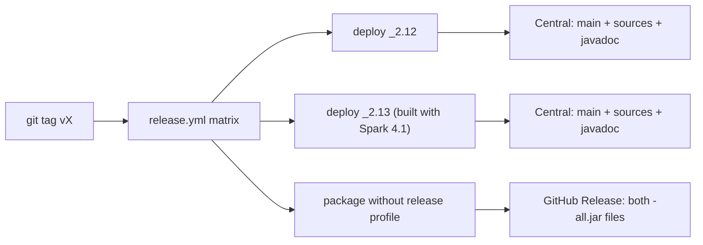
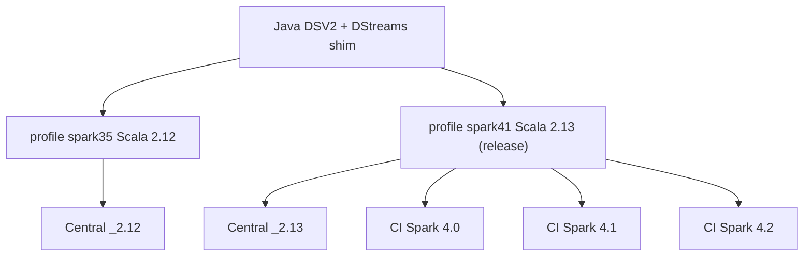

# Publishing to Maven Central

Releases are cut from a `v*` tag (GitHub Portal or `git push`). The workflow publishes thin artifacts to Maven Central, the same coordinates (including `*-all`) to GitHub Packages, and attaches fat JARs to the GitHub Release.

See also how to [register a Maven Central Account](register-maven-account.md)

## What is published where

Maven Central receives only the **thin** artifacts (main JAR, sources, javadoc, POM, signatures). The shaded `*-all.jar` (Google client libraries bundled) is **not** uploaded to Central — it would blow the monthly release-size limit. Fat JARs are built in the same workflow and attached to the GitHub Release for that tag.



## GitHub Actions Release

### Release Workflow



### How to make a release

Create a version tag (and optionally a GitHub Release) in the GitHub Portal, or push a `v*` tag:

```bash
git tag v0.3.0
git push origin v0.3.0
```

Creating a Release in the GitHub UI with a new `v*` tag pushes the tag and starts [`release.yml`](../.github/workflows/release.yml). Prefer that Portal-first path: the workflow then **uploads** `*-all.jar` onto the existing Release. If only the tag is pushed and no Release exists yet, the workflow creates one.

The workflow:

1. Sets the Maven version from the tag (`v` prefix stripped).
2. Deploys thin artifacts for Spark 3.5 (`_2.12`) and Spark 4.1 (`_2.13`) to **Maven Central** (`-Prelease` skips the shade plugin and signs). The `_2.13` JAR is tested in CI against Spark 4.0, 4.1, and 4.2.
1. Deploys thin artifacts for Spark 3.5 (`_2.12`) and Spark 4.1 (`_2.13`) to Central (`-Prelease` skips the shade plugin). The `_2.13` JAR is tested in CI against Spark 4.0, 4.1, and 4.2.
2. Rebuilds with shade enabled and attaches `*-all.jar` to the GitHub Release for the tag.

Consumers should use `--packages` / a Maven dependency against Central. Use the GitHub Release fat JAR only when a single `--jars` file is required (for example Dataproc without Maven resolution).

### Verification

After the Portal shows **Published**, the coordinates appear on Maven Central within minutes to a few hours:

```text
io.github.juarezr:spark-streaming-google-pubsub_2.12:0.3.0
io.github.juarezr:spark-streaming-google-pubsub_2.13:0.3.0
```

The same tag’s GitHub Release should list `spark-streaming-google-pubsub_2.12-0.3.0-all.jar` and `spark-streaming-google-pubsub_2.13-0.3.0-all.jar`.

Do not republish an already-released version without the fat JAR (or with a different set of files). Central is immutable; the next cut must be a new version.

### Thin JAR dependencies

The published POM pins `google-cloud-pubsub`, `google-auth-library-oauth2-http`, and `gson` to versions that stay compatible with Spark 3.5 / Dataproc 2.3. Those pins are not version ranges: a range would float consumers onto newer GAX/gRPC/Guava. Override the Google clients in your own POM or BOM if you need a newer stack.

### Snapshot builds

Snapshots are useful internally (`0.3.0-SNAPSHOT`) but are **not** published to Maven Central.
Use GitHub Packages or GCS for snapshot distribution if needed.
