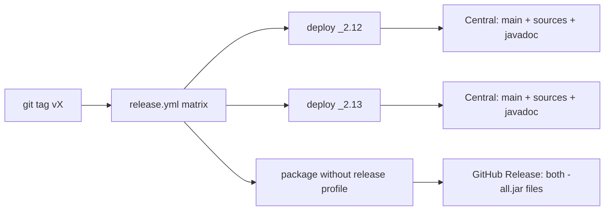

# Publishing to Maven Central

This project publishes via the [Sonatype Central Publisher Portal](https://central.sonatype.com/) using the `central-publishing-maven-plugin` (OSSRH is retired).

## What is published where

Maven Central receives only the **thin** artifacts (main JAR, sources, javadoc, POM, signatures). The shaded `*-all.jar` (Google client libraries bundled) is **not** uploaded to Central — it would blow the monthly release-size limit. Fat JARs are built in the same workflow and attached to the GitHub Release for that tag.



## Registering a Central account

### 1. Create a Central Portal account

1. Register at <https://central.sonatype.com/>
2. Prefer signing in with GitHub so namespaces can be verified automatically.

### 2. Namespace

Published groupId: **`io.github.juarezr`**.

This namespace is already verified in the [Central Portal Namespaces](https://central.sonatype.com/publishing/namespaces) page for this publisher account.

### 3. Generate a portal user token

Account → **Generate User Token**. Store:

- username → GitHub secret `MAVEN_USERNAME`
- password/token → GitHub secret `MAVEN_PASSWORD`

### 4. Create a GPG signing key

```bash
gpg --list-secret-keys
gpg --full-generate-key
gpg --list-secret-keys --keyid-format LONG
gpg --export-secret-keys -a YOUR_KEY_ID > secring.asc
```

GitHub secrets:

| Secret            | Value                     |
|-------------------|---------------------------|
| `GPG_PRIVATE_KEY` | Contents of `secring.asc` |
| `GPG_PASSPHRASE`  | Key passphrase            |
| `MAVEN_USERNAME`  | Portal token username     |
| `MAVEN_PASSWORD`  | Portal token password     |

### 5. Publish public GPG key is not on a keyserver Central can use

1. From the machine that created the key used in GPG_PRIVATE_KEY:

```bash
gpg --list-secret-keys --keyid-format LONG
gpg --keyserver keyserver.ubuntu.com --send-keys YOUR_KEY_ID
gpg --keyserver keys.openpgp.org --send-keys YOUR_KEY_ID
```

1. Confirm it is searchable (wait a few minutes, then):

```bash
gpg --keyserver keyserver.ubuntu.com --recv-keys YOUR_KEY_ID
```

### 6. Local dry-run

```bash
# Thin artifacts only (shade is skipped). Do not use this to produce *-all.jar.
mvn -Pspark35,release clean deploy -DskipTests
mvn -Pspark40,release clean deploy -DskipTests
```

Fat JAR for local use: `mvn -Pspark35 -DskipTests package` (no `release` profile).

Ensure `~/.m2/settings.xml` contains:

```xml
<settings>
  <servers>
    <server>
      <id>central</id>
      <username>${env.MAVEN_USERNAME}</username>
      <password>${env.MAVEN_PASSWORD}</password>
    </server>
  </servers>
</settings>
```

## GitHub Actions Release

Push a version tag:

```bash
git tag v0.3.0
git push origin v0.3.0
```

The [`release.yml`](../.github/workflows/release.yml) workflow:

1. Deploys thin artifacts for both Spark profiles to Central (`-Prelease` skips the shade plugin).
2. Rebuilds with shade enabled and attaches `*-all.jar` to the GitHub Release for the tag.

Consumers should use `--packages` / a Maven dependency against Central. Use the GitHub Release fat JAR only when a single `--jars` file is required (for example Dataproc without Maven resolution).

### Verification

After the Portal shows **Published**, the coordinates appear on Maven Central within minutes to a few hours:

```text
io.github.juarezr:spark-streaming-google-pubsub_2.12:0.3.0
io.github.juarezr:spark-streaming-google-pubsub_2.13:0.3.0
```

The same tag’s GitHub Release should list `spark-streaming-google-pubsub_2.12-0.3.0-all.jar` and `spark-streaming-google-pubsub_2.13-0.3.0-all.jar`.

Do not republish an already-released version without the fat JAR (or with a different set of files). Central is immutable; the next cut must be a new version.

### Snapshot builds

Snapshots are useful internally (`0.3.0-SNAPSHOT`) but are **not** published to Maven Central.
Use GitHub Packages or GCS for snapshot distribution if needed.
