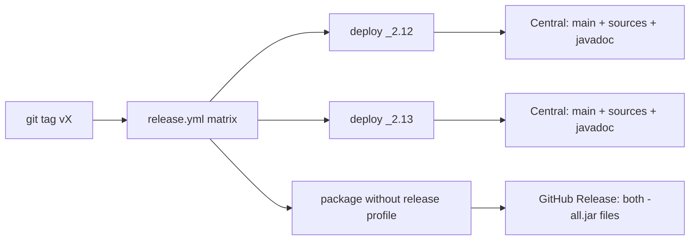
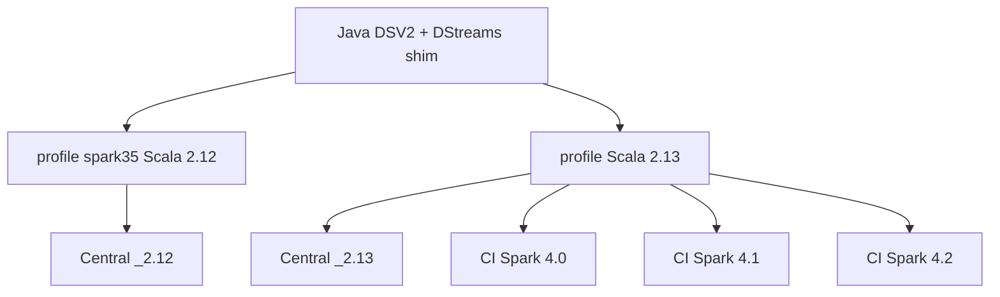

# Publishing to Maven Central

This project publishes via the [Sonatype Central Publisher Portal](https://central.sonatype.com/) using the `central-publishing-maven-plugin` (OSSRH is retired).

See also how to [register a Maven Central Account](register-maven-account.md)

## What is published where

Maven Central receives only the **thin** artifacts (main JAR, sources, javadoc, POM, signatures). The shaded `*-all.jar` (Google client libraries bundled) is **not** uploaded to Central — it would blow the monthly release-size limit. Fat JARs are built in the same workflow and attached to the GitHub Release for that tag.



## GitHub Actions Release

### Release Workflow



### How to make a release

Push a version tag:

```bash
git tag v0.3.0
git push origin v0.3.0
```

The [`release.yml`](../.github/workflows/release.yml) workflow:

1. Deploys thin artifacts for both Spark profiles to Central (`-Prelease` skips the shade plugin).
2. Rebuilds with shade enabled and attaches `*-all.jar` to the GitHub Release for the tag.

Consumers should use `--packages` / a Maven dependency against Central. Use the GitHub Release fat JAR only when a single `--jars` file is required (for example Dataproc without Maven resolution).

### Verification

After the Portal shows **Published**, the coordinates appear on Maven Central within minutes to a few hours:

```text
io.github.juarezr:spark-streaming-google-pubsub_2.12:0.3.0
io.github.juarezr:spark-streaming-google-pubsub_2.13:0.3.0
```

The same tag’s GitHub Release should list `spark-streaming-google-pubsub_2.12-0.3.0-all.jar` and `spark-streaming-google-pubsub_2.13-0.3.0-all.jar`.

Do not republish an already-released version without the fat JAR (or with a different set of files). Central is immutable; the next cut must be a new version.

### Snapshot builds

Snapshots are useful internally (`0.3.0-SNAPSHOT`) but are **not** published to Maven Central.
Use GitHub Packages or GCS for snapshot distribution if needed.
