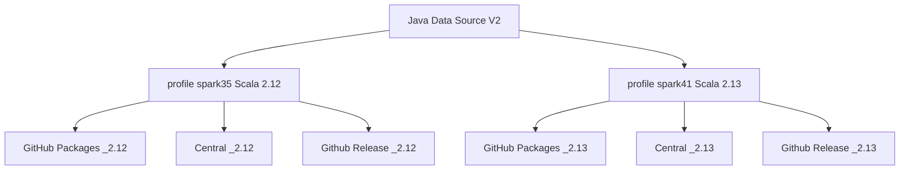
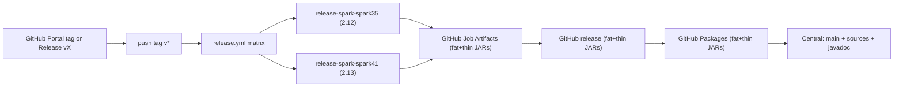

# Publishing to Maven Central and GitHub Packages

This project publishes via the [Sonatype Central Publisher Portal](https://central.sonatype.com/) using the `central-publishing-maven-plugin` (OSSRH is retired), and also deploys the same coordinates to [GitHub Packages](https://docs.github.com/en/packages/working-with-a-github-packages-registry/working-with-the-apache-maven-registry).

Releases are cut from a `v*` tag (GitHub Portal or `git push`). The workflow attaches the same coordinates (including `*-all`)
int the Github Job artifacts first, then attaches to the to the GitHub Release,
then publishes to GitHub Packages, and then publishes thin artifacts to Maven Central.

See also how to [register a Maven Central Account](register-maven-account.md)

## What is published where

Maven Central receives only the **thin** artifacts (main JAR, sources, javadoc, POM, signatures). The shaded `*-all.jar` (Google client libraries bundled) is **not** uploaded to Central — it would blow the monthly release-size limit.



## GitHub Actions Release

### Release Workflow

GitHub Packages receives the Maven publication **including** the `-all` classifier (no `-Prelease`, so shade stays bound). Fat JARs are also attached as files on the GitHub Release for that tag.



### How to make a release

Create a version tag (and optionally a GitHub Release) in the GitHub Portal, or push a `v*` tag:

```bash
git tag v0.8.2
git push origin v0.8.2
```

Creating a Release in the GitHub UI with a new `v*` tag pushes the tag and starts [`release.yml`](../.github/workflows/release.yml). Prefer that Portal-first path: the workflow then **uploads** `*-all.jar` onto the existing Release. If only the tag is pushed and no Release exists yet, the workflow creates one.

The workflow:

1. Sets the Maven version from the tag (`v` prefix stripped).
2. Deploys to **GitHub Packages** with `-Pgithub-packages` (no `-Prelease`): flattened POM, thin JAR, sources, javadoc, and `-all`. This runs before Central so Packages survive Central slowness or 502s.
3. After the Packages matrix jobs finish, attaches `*-all.jar` to the GitHub Release for the tag. This job does not wait on Maven Central.
4. A separate matrix job deploys thin artifacts for Spark 3.5 (`_2.12`) and Spark 4.1 (`_2.13`) to **Maven Central** (`-Prelease` skips the shade plugin and signs). The `_2.13` JAR is tested in CI against Spark 4.0, 4.1, and 4.2.

CI waits until Central **validates** the bundle (`waitUntil=validated`), then **auto-publishes**. The job does not block until the artifact is live on search.maven.org.

Consumers should use `--packages` / a Maven dependency against Central when possible. Use the GitHub Release fat JAR when a single `--jars` file is required (for example Dataproc without Maven resolution). GitHub Packages is an extra Maven registry for the same coordinates; **Maven still requires authentication** to download even public packages.

Example `settings.xml` server for GitHub Packages:

```xml
<server>
  <id>github</id>
  <username>YOUR_GITHUB_USERNAME</username>
  <password>YOUR_GITHUB_PAT_OR_TOKEN</password>
</server>
```

Repository URL: `https://maven.pkg.github.com/juarezr/spark-streaming-google-pubsub`

### Verification

After Central validates the bundle, auto-publish continues in the background. Appearance on search.maven.org can still take minutes to a few hours after the Portal shows **Published**:

```text
io.github.juarezr:spark-streaming-google-pubsub_2.12:0.8.2
io.github.juarezr:spark-streaming-google-pubsub_2.13:0.8.2
```

The same coordinates should appear under the repo’s GitHub Packages. The same tag’s GitHub Release should list `spark-streaming-google-pubsub_2.12-0.8.2-all.jar` and `spark-streaming-google-pubsub_2.13-0.8.2-all.jar`.

Do not republish an already-released version without the fat JAR (or with a different set of files). Central is immutable; the next cut must be a new version.

### Thin JAR dependencies

The published POM pins `google-cloud-pubsub`, `google-auth-library-oauth2-http`, and `gson` to versions that stay compatible with Spark 3.5 / Dataproc 2.3. Those pins are not version ranges: a range would float consumers onto newer GAX/gRPC/Guava. Override the Google clients in your own POM or BOM if you need a newer stack.

### Snapshot builds

Snapshots are useful internally (`0.8.2-SNAPSHOT`) but are **not** published to Maven Central.
Use GitHub Packages or GCS for snapshot distribution if needed (`-Pgithub-packages`).
